# AdventureWorks Sales Performance Analysis

## Overview
AdventureWorks is a multinational manufacturer and retailer of bicycles and cycling accessories, operating since the early 2000s. The company sells road bikes, mountain bikes, touring bikes, components, clothing, and accessories across six countries. Its business model combines traditional retail stores with a growing e-commerce platform, allowing customers to purchase both in-store and online.

As part of the Data Team at AdventureWorks, I partnered with the Sales Manager to analyse company sales performance and identify opportunities to improve revenue quality and operational efficiency. The dataset contains 121k+ transactions recorded between July 2001 and July 2004, providing a comprehensive view of sales activity across products, markets, and channels.

The analysis focuses on key business metrics including Revenue, Profit Margin, Repeat Customer Rate, Average Order Value (AOV), and Channel Mix. To address the business questions, insights and recommendations are provided on the following key areas, enabling the Sales, Marketing, Product and Finance Teams to improve resource allocation, product strategy, and customer retention initiatives.

- **Revenue Trends & Seasonality:** Analysis of revenue growth across fiscal years, identifying predictable seasonal peaks and periods of weaker demand that affect revenue stability.
- **Product Performance & Category Dynamics:** Evaluation of sales contribution across product categories and individual SKUs, highlighting revenue concentration in Bike products and margin expansion opportunities in Accessories and other complementary categories.
- **Channel Performance:** Comparison of online and offline sales channels to understand differences in transaction volume, revenue contribution, and customer purchasing behavior.
- **Geographic Market Performance:** Assessment of regional sales distribution, focusing on the dominance of the US market and opportunities to diversify revenue through international market expansion.
- **Sales Team Productivity:** Analysis of revenue contribution across sales representatives to identify productivity patterns.
- **Customer Retention**: Examination of repeat purchase rates to evaluate customer loyalty and opportunities to increase long term customer value.

The SQL queries used to inspect and clean the data for this analysis can be found here [link].

Targed SQL queries regarding various business questions can be found here [link].

An interactive PowerBI dashboard used to report and explore sales trends can be found here [link].

## ERD
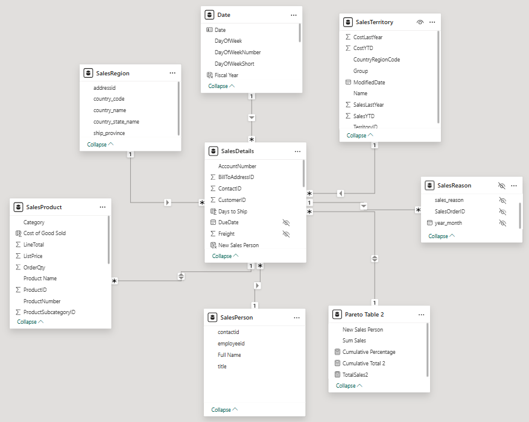

## Executive Summary

Across July 2001–July 2004, AdventureWorks achieved strong and consistent revenue growth, supported by effective seasonal campaigns, high-performing products, and a dominant presence in the US market. Sales volume increased significantly over the period, with clear revenue peaks during summer and holiday months, indicating strong execution during key promotional windows.

At the same time, the analysis shows that revenue remains concentrated across specific products, markets, and sales contributors. Customer purchasing behaviour and channel performance reveal opportunities to improve digital revenue efficiency, strengthen retention, and expand higher-margin categories such as Accessories to support more balanced and sustainable growth.

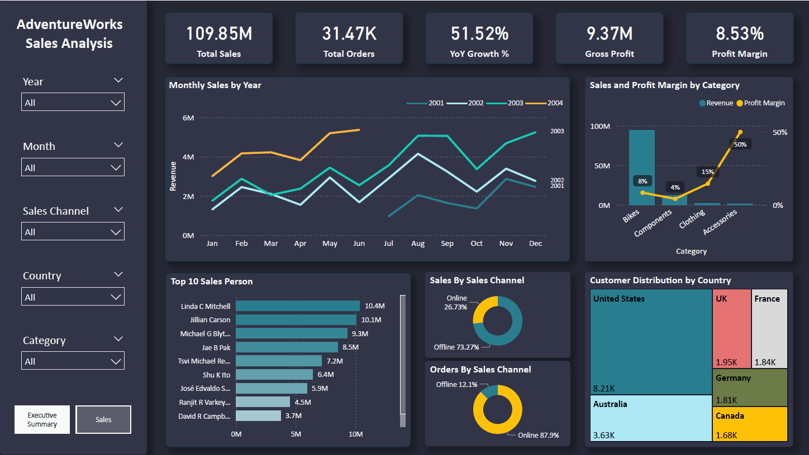

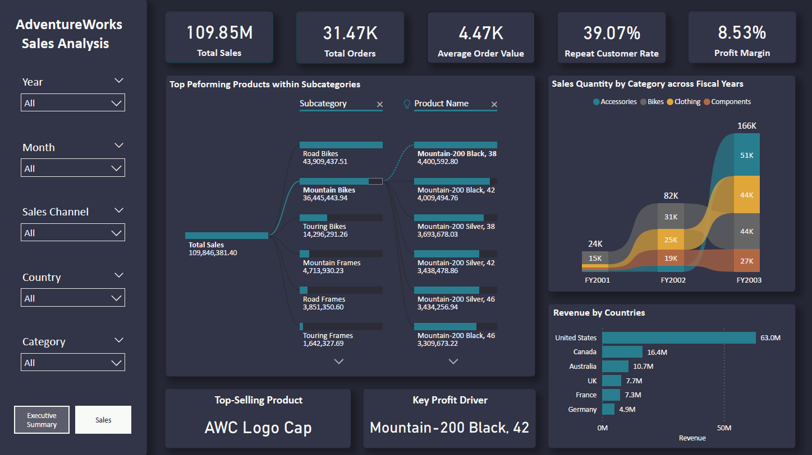

## Insights Deep Dive
### Steady revenue growth across years with strong seasonality in sales
AdventureWorks generated $109.85M in total revenue from 31.47K orders. Revenue increased consistently, with predictable peaks in May–August and October–November. The highest recorded monthly revenue reached $5.36M, validating the impact of well-timed campaigns.  These peaks reflect successful campaign execution and strong seasonal demand.

At the same time Early-year performance suggests that revenue growth remains highly campaign-driven. Strengthening off-season demand generation could help smooth revenue fluctuations and improve forecasting stability.

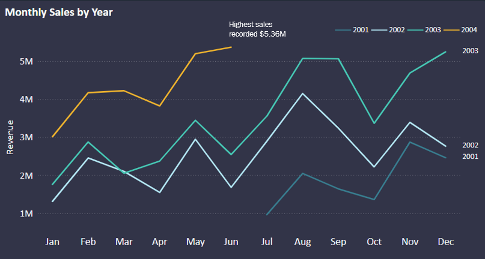

### Dominance of US market in sales performance. High potential in expanding customer base across regions
Geographically, revenue remains heavily concentrated in the US, which contributes over 60% of total sales. Although international markets are expanding and the revenue gap between the US and other regions has narrowed over time, dependency on a single dominant market remains high. 

This concentration creates exposure to regional demand fluctuations and limits global growth potential. Expanding the customer base across international markets such as Canada, Australia, and Europe presents a key opportunity to diversify revenue streams and reduce geographic risk.

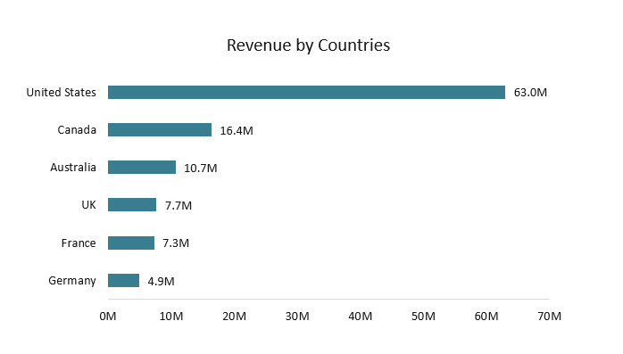

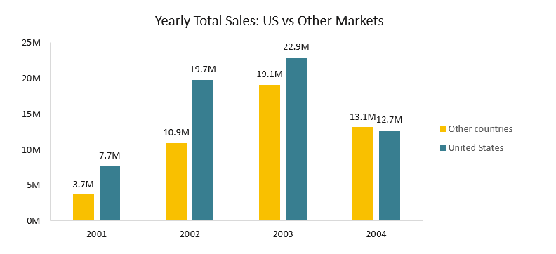

### Product mix is revenue led by Bikes, but margin expansion potential exists in complementary categories such as Accessories.

**Revenue Concentration:** Road Bikes ($43.9M) and Mountain Bikes ($36.4M) dominate total revenue, with the Mountain-200 Black model is the key revenue generatore. Revenue is therefore structurally concentrated in core Bike categories, indicating strong product market fit but limited diversification at the top line level.

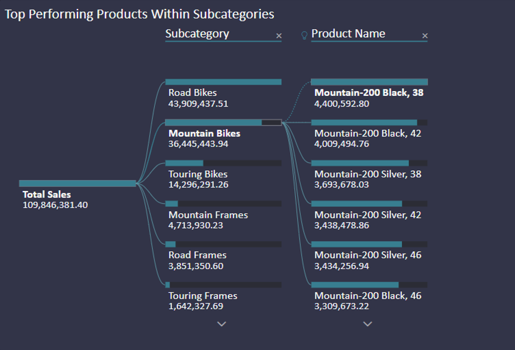

**Sales volume growth:** Total quantity sold increased significantly from 24K units (FY2001) to 166K units (FY2003), representing approximately 6.9x growth ver two fiscal years.  Accessories show the most notable proportional growth, indicating rising interest in complementary purchases.

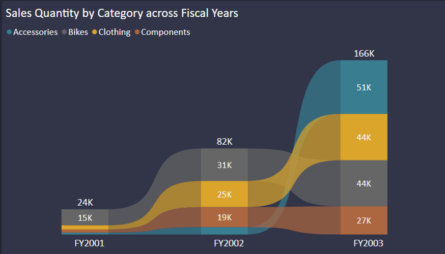

**Category dynamics:** While Bikes provide revenue scale, Accessories demonstrate stronger relative growth and margin potential. Expanding Accessories and activating underperforming segments like Clothing and Components could improve margin contribution and create a more balanced product mix.

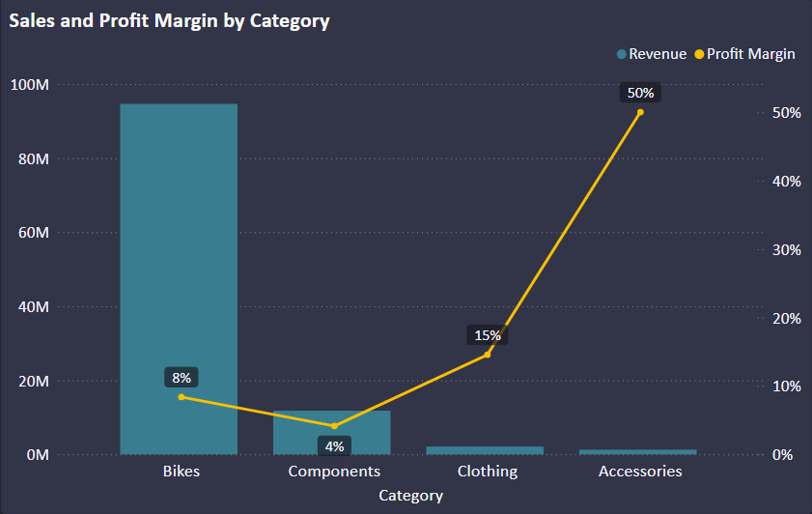

### Channel dynamics show a clear behavioral split: online drives transaction volume, while offline drives higher value revenue.
Channel performance shows a clear behavioural split between online and offline customers. Offline sales generate 73.27% of total revenue but account for only 12% of orders, indicating that customers tend to make larger purchases in physical stores where they can interact with products and sales representatives.

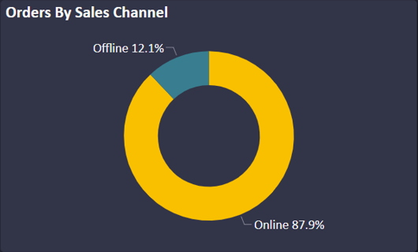 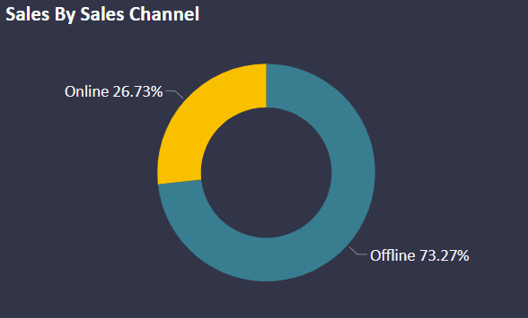

In contrast, online channels represent 88% of transactions, suggesting that customers prefer the convenience of digital platforms for smaller and more frequent purchases.
This discrepancy highlights different purchasing intents across channels. Increasing online Average Order Value (AOV) through bundling and cross-selling strategies could unlock additional revenue without disrupting the high-value offline sales base.

### Sales performance is concentrated among a small group of representatives
Offline revenue performance is heavily dependent on a small number of high-performing sales representatives. The top 5 salespeople generate 56% of total offline sales, reflecting strong individual productivity but also exposing operational concentration risk. Such reliance on a few individuals suggests uneven capability across the broader sales team. These findings highlight the importance of training and mentorship programs.

### Customer retention presents a growth opportunity
The repeat customer rate stands at 39.07%, indicating that while a substantial portion of customers return to make additional purchases, the majority of customers still purchase only once.

Improving retention through loyalty programs, targeted engagement campaigns, and post-purchase communication could significantly increase customer lifetime value. Strengthening retention would also help stabilize revenue and reduce reliance on continuous new customer acquisition.

## Recommendations

Our analysis supports a shift from pure revenue growth to revenue quality, stability, and scalability. The following recommendations are structured by strategic priority, with clear ownership across Sales, Marketing, Finance, Production, and Operations.
- **Stabilize Revenue Outside Peak Windows:**
    
    Revenue peformance is heavily seasonal with strong peaks during campaign periods and weaker results earlier in the year. To reduce this volatility, the Marketing Team should strengthen pre-holiday and seasonal campaigns to capture early shoppers. At the same time, the Sales Team can focus on engaging high value customer segments during off-peak periods through targeted outreach and personalised offers. This initiative aims to improve revenue predictability, smooth seasonality, and strengthen forecasting accuracy for the Finance Team.
- **Improve Online Revenue Quality:**

    With 88% of transactions occurring online but lower average order value (AOV) relative to offline channels, digital growth need shift from volume to value. We recommend that the Sales and Marketing Teams implement structured cross-selling and bundling strategies (for example pairing Bikes with Accessories). Digital merchandising and product recommendations should also be optimised to encourage complementary purchases. Marketing should review the allocation of budgets toward high performing digital acquisition channels. This is expected to increase online AOV and improve overall revenue efficiency.
- **Optimize Product Mix Toward Margin Expansion:**

    Revenue concentration in Bikes limits profitability leverage, while Accessories and Clothing demonstrate strong proportional growth. We recommend that the Product Team expand the product line in Accessories and Clothing to capture additional deman and explore variations of successful products such as the Mountain-200 Black. 

    Given the growing interest in Accessories, there is also a clear opportunity to implement cross-selling strategies between Bikes, Accessories, and Clothing, particularly through bundling initiatives that increase AOV. Underperforming categories like Components may require repositioning or bundling support to improve penetration. In parallel, Finance should review pricing and cost structures within core Bike categories to protect margins.
This approach is expected to rebalance product mix and increase margin contribution without compromising scale.
- **Diversify Revenue Beyond the US Market:**

    With over 60% of revenue concentrated in the US, geographic diversification should be prioritized. We recommend replicating successful US strategies in high growth international markets, led by Marketing and Sales Teams, with localized campaign adaptation and region specific product positioning. This will strengthen revenue diversification and reduce single-market dependency risk.
- **Scale Sales Capability Across the Team:**

    Sales leadership should formalise mentorship programs and document best practices to transfer knowledge across the team. Incentive structures can also be adjusted to motivate mid-tier performers while continuing to reward top contributors. This is expected to reduce performance concentration risk and improve Sales team’s productivity

## Tools & Technologies
* SQL (BigQuery): Data extraction and transformation from AdventureWorks database
* DAX: Advanced calculations and data modeling
* Power BI: Interactive dashboard creation and data visualization
* Data Analysis: Statistical analysis and trend identification
